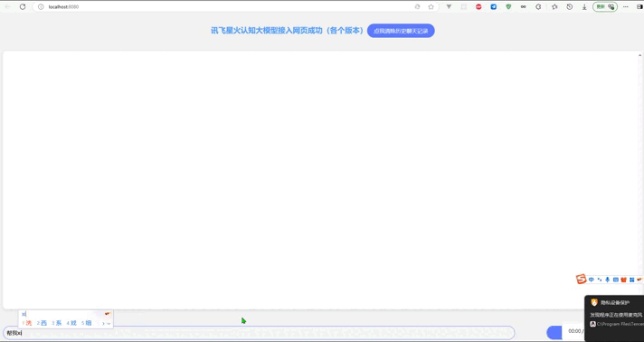
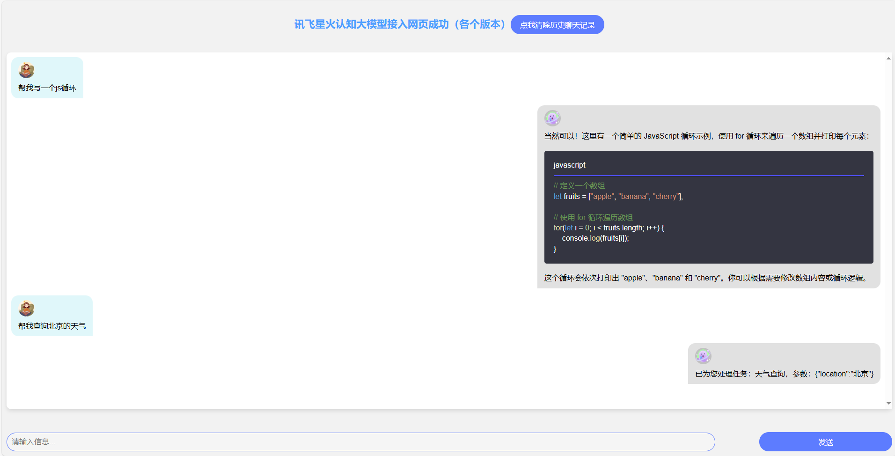
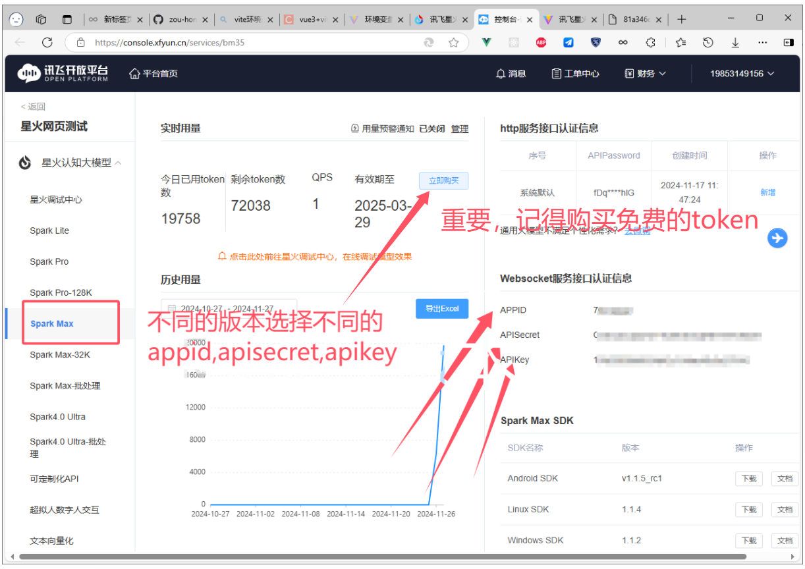
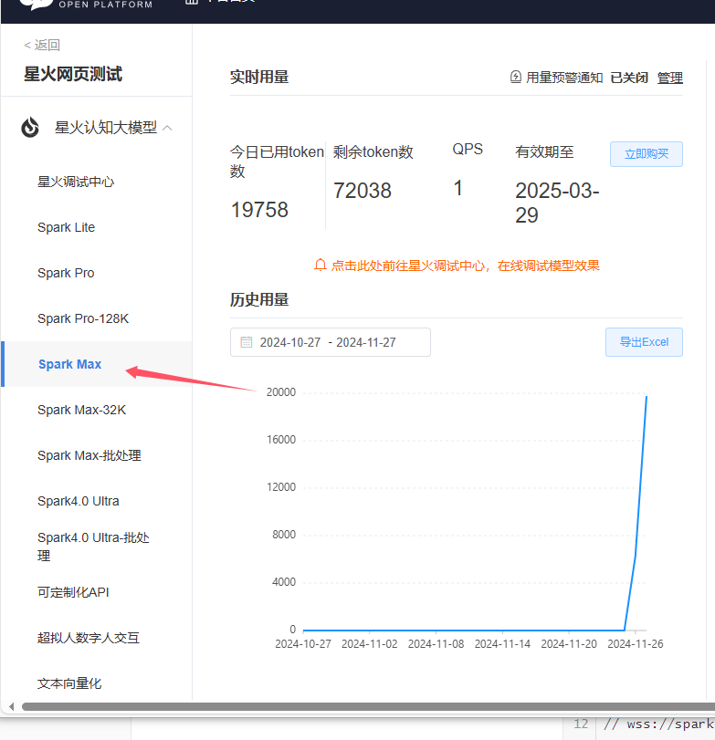
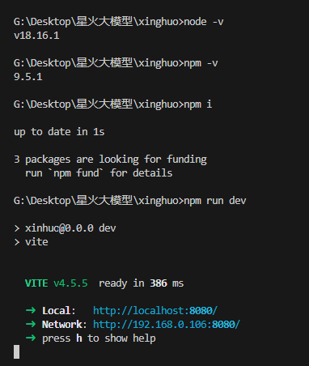

# 前端项目接入星火认知大模型demo

## 导言

> 随着国内的语言大模型不断兴起，科大讯飞的星火大模型，阿里的通义千问，百度的文心一言等。
>
> 这些大模型给我提供了很好的便利
>
> 同时星火大模型提供了 **开放 `API` 功能** 使得我们能够将大模型接入到我们自己的项目当中。
>
> 这使得该项目的产生
## 项目地址

[zou-hong-run/xinghuo: 讯飞星火认知大模型接入网页 (github.com)](https://github.com/zou-hong-run/xinghuo)

## 项目演示、项目部署视频地址

[超棒更新！项目接入ai讯飞大模型4.0Ultra接入functioncall功能_哔哩哔哩_bilibili](https://www.bilibili.com/video/BV19SAmeREix/?spm_id_from=333.1387.homepage.video_card.click)

## 项目介绍（实现的功能）

- 接入讯飞星火**4.0 Ultra**大模型 `API` ,

- 接入 `function call`  

  - 可以让大模型调用自己设置的  `API` 并传递对应的**参数**
    -  自定义处理逻辑 可以做任何事 和其他软件，硬件通讯，执行爬虫，发送指令，操作其他软件
    - 注：当前仅Spark Max/4.0 Ultra 支持了该功能；
    - 需要请求参数payload.functions中申明大模型需要辨别的外部接口

- 历史记录保存，清理

- 上下理解能力，配合历史记录，可以理解用户对话内容

- 内容实时渲染，`websocket` 实时消息渲染每一个字

  
## 体验地址（感谢git pages）
https://zou-hong-run.github.io/xinghuo/dist/index.html
new





old


## 小提示

> 为了方便大家进行项目二次开发，本项目使用原生 `html+javascript+css` 实现，不与任何框架进行绑定。
>
> - 2025-02-23 日志 
>
>   - 新增 `function call` 维护配置模块
>
>     - 让 `AI` 打破物理边界，万物互联。
>
>     - [星火认知大模型Web API文档 | 讯飞开放平台文档中心](https://www.xfyun.cn/doc/spark/Web.html#_2-function-call说明)
>
>     - 如何定义 function call ，下面代码是我封装的规范，可以去b站看我视频讲解
>
>       - ```
>         // utils/functions.js
>         /**
>          * 注：当前仅Spark Max/4.0 Ultra
>               支持了该功能；需要请求参数payload.functions中申明大模型需要辨别的外部接口
>          * 
>          */
>         
>         // 初始化默认的天气查询 function
>         const weatherFunction = {
>           name: "天气查询",
>           // 描述越清晰越好，大模型会理解你需要的东西，然后传递参数
>           description: "天气插件可以提供天气相关信息。你可以提供指定的地点信息、指定的时间点或者时间段信息，来精准检索到天气信息。",
>           parameters: {
>             type: "object",
>             properties: {
>               location: {
>                 type: "string",
>                 description: "地点，比如北京。"
>               },
>               date: {
>                 type: "string",
>                 description: "日期。"
>               }
>             },
>             required: ["location", 'date']
>           },
>           // 自定义处理逻辑 可以做任何事 和其他软件，硬件通讯，执行爬虫，发送指令，操作其他软件
>           handler: async (params) => {
>             console.log(params);
>             let location = params.location;
>             if (location == "北京") { window.open("https://weather.cma.cn/web/weather/54511.html") }
>             else if (location == "山东") {
>               window.open("https://weather.cma.cn/web/weather/013462.html")
>             }
>             // return "需要的话可以将返回结果告诉用户"
>           }
>         };
>         ```
>
>   - 新增历史记录维护模块
>
>     - 自动保存历史**聊天记录**，提供删除聊天记录功能。
>
>   - 优化交互效果，**实时输出**。自动代码片段美化
>
>   - 美化页面，可以看老版有多丑哈哈哈哈


## 运行项目

- 下载该项目

- 到讯飞开发平台注册账户，这样可以添加应用

  - [讯飞开放平台-以语音交互为核心的人工智能开放平台 (xfyun.cn)](https://www.xfyun.cn/)

- 到讯飞控制台添加一个应用，这样可以获取 APPID，APISecret，APIKey等

  - [控制台-讯飞开放平台 (xfyun.cn)](https://console.xfyun.cn/app/myapp)
  - 

- 打开我们项目

  - 修改xinghuodemo/.env中的代码，填写自己的APPID，APISecret，APIKey

  - 

    - 这里的Spark Max对应下面的注释
    
    ```
    .env
    // Tips: 星火大模型API当前有Lite、Pro、Pro-128K、Max、Max-32K和4.0 Ultra六个版本，各版本独立计量tokens。
    
    // 传输协议 ：ws(s),为提高安全性，强烈推荐wss
    
    // Spark4.0 Ultra 请求地址，对应的domain参数为4.0Ultra：
    // wss://spark-api.xf-yun.com/v4.0/chat
    
    // Spark Max-32K请求地址，对应的domain参数为max-32k
    // wss://spark-api.xf-yun.com/chat/max-32k
    
    // Spark Max请求地址，对应的domain参数为generalv3.5
    // wss://spark-api.xf-yun.com/v3.5/chat
    
    // Spark Pro-128K请求地址，对应的domain参数为pro-128k：
    //  wss://spark-api.xf-yun.com/chat/pro-128k
    
    // Spark Pro请求地址，对应的domain参数为generalv3：
    // wss://spark-api.xf-yun.com/v3.1/chat
    
    // Spark Lite请求地址，对应的domain参数为lite：
    // wss://spark-api.xf-yun.com/v1.1/chat
    
    // 填写对应 appid apisecret apikey
    VITE_APP_SPARK_APPID='xxx'
    VITE_APP_SPARK_APISECRET='xx'
    VITE_APP_SPARK_APIKEY='xx#   '
    // 看上面注释，选择对应版本的domain
    VITE_APP_DOMAIN='generalv3'
    // 看上面注释，选择对应的地址
    VITE_APP_SPARK_URL='wss://spark-api.xf-yun.com/v3.1/chat'
    // 用户唯一标识（随便填）
    VITE_APP_SPARK_UID='red润'
    ```

- 然后执行下面指令

	- 电脑上需要安装node[Node.js — 在任何地方运行 JavaScript](https://nodejs.org/zh-cn)
  
  - 
  
  	
    
  - ```
  G:\Desktop\星火大模型\xinghuo>node -v
  	v18.16.1
    
    G:\Desktop\星火大模型\xinghuo>npm -v
    9.5.1
    
    G:\Desktop\星火大模型\xinghuo>npm i
    
    up to date in 1s
    
    3 packages are looking for funding
      run `npm fund` for details      
    
    G:\Desktop\星火大模型\xinghuo>npm run dev
    
    > xinhuo@0.0.0 dev
    > vite
    
    
      VITE v4.5.5  ready in 386 ms
    
      ➜  Local:   http://localhost:8080/
      ➜  Network: http://192.168.0.106:8080/
      ➜  press h to show help
    
    
    ```
  
- 然后访问地址，可以开始使用啦

  - http://localhost:5173/
  - 
  

## show代码(old版本，可以看看老版本是如何实现的，可以和新版本的做对比)

> 网页布局代码

``` html
<!doctype html>
<html lang="en">

<head>
  <meta charset="UTF-8" />
  <link rel="icon" type="image/svg+xml" href="/vite.svg" />
  <meta name="viewport" content="width=device-width, initial-scale=1.0" />
  <title>讯飞星火认知大模型接入网页成功</title>
  <style>
    * {
      margin: 0;
      padding: 0;
      box-sizing: border-box;
    }
    h1{
      text-align: center;
      color: #5165EA;
    }
    html,body{
      width: 100%;
      height: 100%;
      background-color: #F3F8F9;
    }
    body{
      padding: 10%;
    }
    #results{
      width: 100%;
      height: 80%;
      background-color: #E2EEFF;
    }
    #results #result{
      width: 100%;
      height: 100%;
      padding: 10%;
      
      background-color: #E2EEFF;
      white-space:pre-line;
    }
    #sendVal{
      display: flex;
      width: 100%;
      height: 20%;
    }
    #sendVal #question{
      width: 70%;
      height: 100%;
      padding: 5%;
      border: 2px dotted blue;
    }
    #sendVal #btn{
      width: 30%;
      height: 100%;
      background-color: #5D7CFF;
    }
    
    
    
  </style>
</head>

<body>
  <h1>讯飞星火认知大模型接入网页成功</h1>
  <div id="results">
    <textarea id="result"></textarea>
  </div>
  <div id="sendVal">
    <input id="question" type="text">
    <button id="btn">发送信息</button>
  </div>
  <script type="module" src="main.js"></script>
</body>

</html>
```

> 功能实现代码 main.js
``` JavaScript
import * as base64 from 'base-64'
import CryptoJs from 'crypto-js'

let questionInput = document.querySelector("#question");
let sendMsgBtn = document.querySelector("#btn");
let result = document.querySelector("#result");

let requestObj = {
    APPID: '',
    APISecret: '',
    APIKey: '',
    Uid:"red润",
    sparkResult: ''
}
// 点击发送信息按钮
sendMsgBtn.addEventListener('click', (e) => {
    sendMsg()
})
// 输入完信息点击enter发送信息
questionInput.addEventListener('keydown', function (event) {
    if (event.key === 'Enter') { sendMsg(); }
});
// 发送消息
const sendMsg = async () => {
    // 获取请求地址
    let myUrl = await getWebsocketUrl();
    // 获取输入框中的内容
    let inputVal = questionInput.value;
    // 每次发送问题 都是一个新的websocketqingqiu
    let socket = new WebSocket(myUrl);

    // 监听websocket的各阶段事件 并做相应处理
    socket.addEventListener('open', (event) => {
        console.log('开启连接！！', event);
        // 发送消息
        let params = {
            "header": {
                "app_id": requestObj.APPID,
                "uid": "redrun"
            },
            "parameter": {
                "chat": {
                    "domain": "general",
                    "temperature": 0.5,
                    "max_tokens": 1024,
                }
            },
            "payload": {
                "message": {
                    // 如果想获取结合上下文的回答，需要开发者每次将历史问答信息一起传给服务端，如下示例
                    // 注意：text里面的所有content内容加一起的tokens需要控制在8192以内，开发者如有较长对话需求，需要适当裁剪历史信息
                    "text": [
                        { "role": "user", "content": "你是谁" }, //# 用户的历史问题
                        { "role": "assistant", "content": "我是AI助手" },  //# AI的历史回答结果
                        // ....... 省略的历史对话
                        { "role": "user", "content": inputVal },  //# 最新的一条问题，如无需上下文，可只传最新一条问题
                    ]
                }
            }
        };
        console.log("发送消息");
        socket.send(JSON.stringify(params))
    })
    socket.addEventListener('message', (event) => {
        let data = JSON.parse(event.data)
        // console.log('收到消息！！',data);
        requestObj.sparkResult += data.payload.choices.text[0].content
        if (data.header.code !== 0) {
            console.log("出错了", data.header.code, ":", data.header.message);
            // 出错了"手动关闭连接"
            socket.close()
        }
        if (data.header.code === 0) {
            // 对话已经完成
            if (data.payload.choices.text && data.header.status === 2) {
                requestObj.sparkResult += data.payload.choices.text[0].content;
                setTimeout(() => {
                    // "对话完成，手动关闭连接"
                    socket.close()
                }, 1000)
            }
        }
        addMsgToTextarea(requestObj.sparkResult);
    })
    socket.addEventListener('close', (event) => {
        console.log('连接关闭！！', event);
        // 对话完成后socket会关闭，将聊天记录换行处理
        requestObj.sparkResult = requestObj.sparkResult + "&#10;"
        addMsgToTextarea(requestObj.sparkResult);
        // 清空输入框
        questionInput.value = ''
    })
    socket.addEventListener('error', (event) => {
        console.log('连接发送错误！！', event);
    })
}
// 鉴权url地址
const getWebsocketUrl = () => {
    return new Promise((resovle, reject) => {
        let url = "wss://spark-api.xf-yun.com/v1.1/chat";
        let host = "spark-api.xf-yun.com";
        let apiKeyName = "api_key";
        let date = new Date().toGMTString();
        let algorithm = "hmac-sha256"
        let headers = "host date request-line";
        let signatureOrigin = `host: ${host}\ndate: ${date}\nGET /v1.1/chat HTTP/1.1`;
        let signatureSha = CryptoJs.HmacSHA256(signatureOrigin, requestObj.APISecret);
        let signature = CryptoJs.enc.Base64.stringify(signatureSha);

        let authorizationOrigin = `${apiKeyName}="${requestObj.APIKey}", algorithm="${algorithm}", headers="${headers}", signature="${signature}"`;

        let authorization = base64.encode(authorizationOrigin);

        // 将空格编码
        url = `${url}?authorization=${authorization}&date=${encodeURI(date)}&host=${host}`;

        resovle(url)
    })
}
/** 将信息添加到textare中
    在textarea中不支持HTML标签。
    不能使用
    标签进行换行。
    也不能使用\r\n这样的转义字符。

    要使Textarea中的内容换行，可以使用&#13;或者&#10;来进行换行。
    &#13;表示回车符；&#10;表示换行符；
*/
const addMsgToTextarea = (text) => {
    result.innerHTML = text;
}


```

## 结尾

很久前我就开始研究如何接入各家大模型，但是人家还没有开放api出来，星火大模型是最先出的，太棒了！！
觉得不错的请三连支持一下！！！bxin


## 公众号

已经接入ai，可以找他聊天，没事更点技术文章

[zou-hong-run/wechat-ai-spark: 微信公众号接入AI讯飞星火认知大模型（express+websocket）](https://github.com/zou-hong-run/wechat-ai-spark)


## 赞助

您的支持是我最大的更新动力


