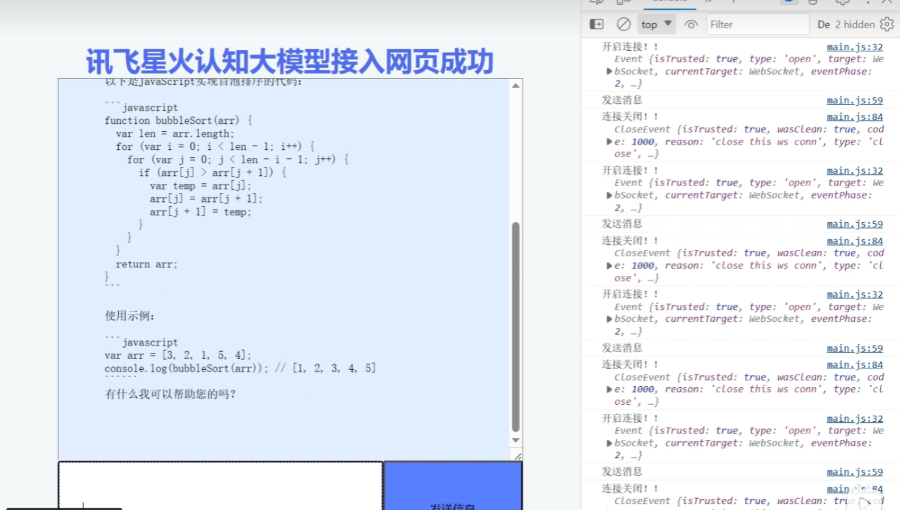

# 项目接入星火认知大模型demo

## 运行项目

- 下载该项目

- 到讯飞开发平台注册账户，这样可以添加应用

  - [讯飞开放平台-以语音交互为核心的人工智能开放平台 (xfyun.cn)](https://www.xfyun.cn/)

- 到讯飞控制台添加一个应用，这样可以获取 APPID，APISecret，APIKey等

  - [控制台-讯飞开放平台 (xfyun.cn)](https://console.xfyun.cn/app/myapp)

- 打开我们项目

  - 修改xinghuodemo/main.js中的代码，填写自己的APPID，APISecret，APIKey

    ```
    	let requestObj = {
    	    APPID: '',
    	    APISecret: '',
    	    APIKey: '',
    	    Uid:"随机用户名",
    	    sparkResult: ''
    	}
    ```

- 然后执行下面指令

	```
    cd xinghuodemo
    pnpm i
    pnpm run dev
  ```
  
- 然后访问地址，可以开始使用啦

  - http://localhost:5173/
  - 
  

